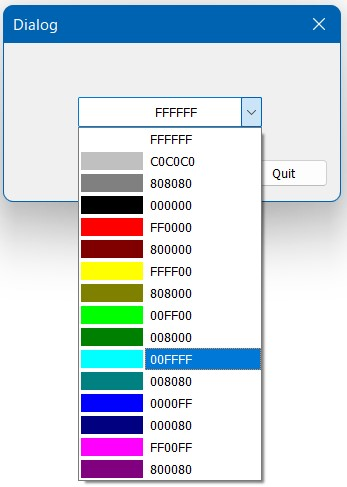

## 概要
- 色の選択が可能なドロップダウンリストです。

## 開発環境 Development Environment
- Windows 10 Home 64bit  
- Visual Studio 2019  
- Visual C++ (MFC : not used.)  

## ライセンス License
- MIT License  

## 実行サンプル Sample Image

